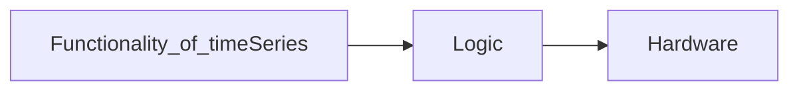
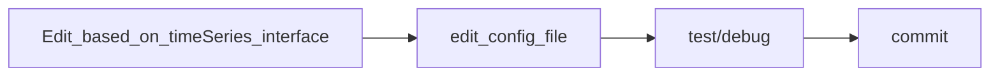

# TIMELINE - Sepctrum Time Series DEV

---
## STEPs (✅ / ❌):
1. Get familiar with QUDI Architecture (❌)
2. Get familiar with Nidaq Python Interface && achieve general Functions(❌)
3. Get familiar with Nidaq based TimeSeries module in Qudi(❌)
4. Get familiar with Sepctrum Python Interface && achieve general Functions(❌)
5. Edit/Test/Commit Spectrum based TimeSeries module in Qudi(❌)

--- 
## Get familiar with QUDI Architecture

Find article on site: https://www.sciencedirect.com/science/article/pii/S2352711017300055

Introduce the basic architecture of Qudi framework.

--- 
## Get familiar with Nidaq Python Interface && achieve general Functions

**Process:**
1. Know Nidaq card version and specific Feature (max. sampling freq e.t.c.)
2. download basic Python external interface from website (based on card version) -> compare official version with local developed test files
3. test locally

--- 
## Get familiar with Nidaq based TimeSeries module in Qudi

**Process:**
1. read Nidaq based timeSeries module and correspondings code files in our commited repo
2. know how it works and the architecture of this logic based on following level:

--- 
## Get familiar with Sepctrum Python Interface && achieve general Functions

**Process:**
1. Know Sepctrum card version and specific Feature (max. sampling freq e.t.c.)
2. download basic Python external interface from website (based on card version) -> compare official version with local developed test files
3. test locally

--- 
## Edit/Test/Commit Spectrum based TimeSeries module in Qudi

